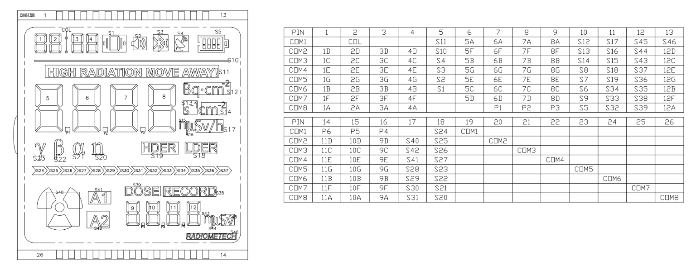
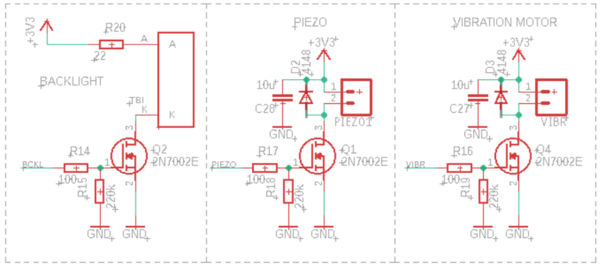
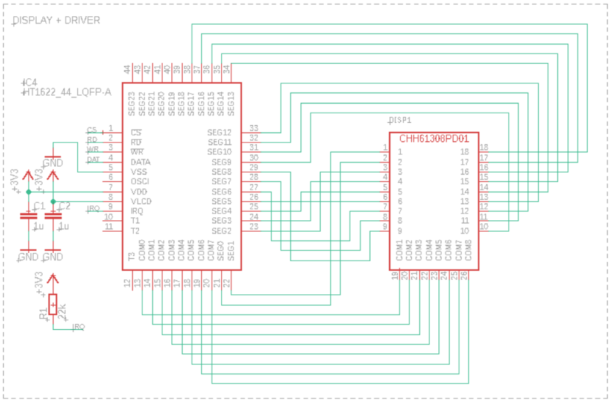

## Geiger sensor

## Schematics

* PA0 – wybudzenie lub uśpienie licznika – ultralow power
* PA1 – napiecie z baterii do kontroli stanu baterii na LCD
* PA2, PA3 – UART dla modułu BT, nieużywany, można sobie przylutować do debugu – UTY
* PA4-PB0 – komunikacja z HT1622_44 – obsługa customowego LCDka
* PB1 – włączenie przetwornicy WN dla GM
* PB2 – wyjście dla piezo (klikanie po detekcji i alarm) jeżeli będzie za cicho dołoże IC booster
* PA8 – impulsy z licznika z dużej dawki (przerwanie + timer)
* PA9 – podświetlenie LCD
* PA10 – wyjście na wibrator huehue
* PA11- impulsy z licznika z małej dawki (przerwanie + timer)
* PA15 - impulsy z licznika z dużej dawki (przerwanie + timer)
* PB3 - impulsy z licznika z małej dawki (przerwanie + timer)
* PB4 – Switch 3
* PB5 – Switch 1
* PB6 – dla modułu BT, nieużywany
* PB7 - dla modułu BT, nieużywany

